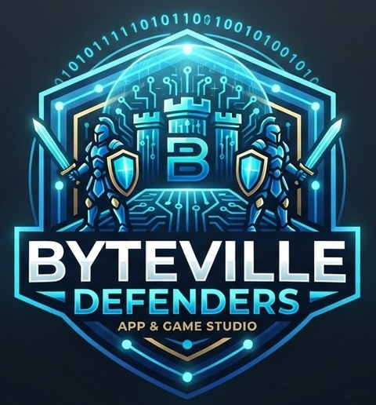
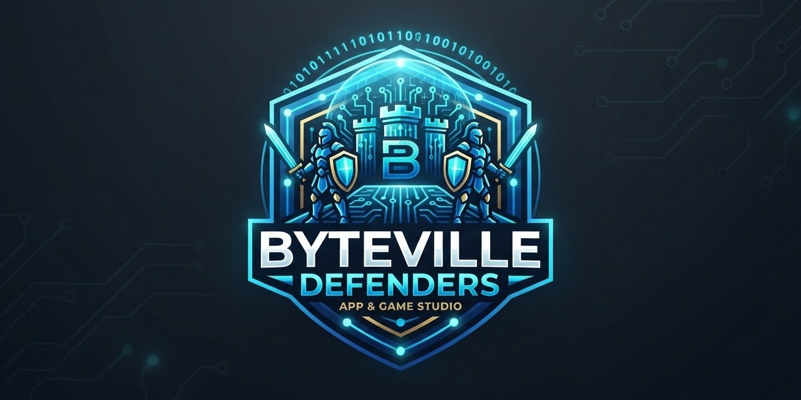

<p align="center">
  
</p>

<p align="center"><b>A guided game that teaches cybersecurity by protecting a small town.</b><br>
Firewalls · intrusion detection and prevention · phishing · passwords and MFA · security controls</p>

<p align="center">
  <a href="#play"><b>Play</b></a> ·
  <a href="#whats-inside">What's inside</a> ·
  <a href="#for-teachers">For teachers</a> ·
  <a href="#security">Security</a> ·
  <a href="#license">License</a>
</p>

---

## Play

**[Play Byteville Defenders](https://YOUR-USERNAME.github.io/byteville-defenders/)**. It runs in any browser, on a laptop or a phone. There's nothing to install and no account to create.

## What's inside

Byteville runs on computers, and hackers are knocking on its doors. Officer Ada, the town's security chief, trains the player one idea at a time. Each idea gets a short lesson in plain words, a quick check, and then a challenge.

**Training Camp: 8 chapters, about 45 minutes**

| | Place | You learn | You play |
| --- | --- | --- | --- |
| 1 | Town Hall | The CIA triad | Sort real problems into Confidentiality, Integrity, Availability |
| 2 | The Locksmith | Passwords and MFA | Pick the stronger key |
| 3 | Post Office | Phishing | Check an inbox for fakes |
| 4 | Hardware Store | Security controls | Prevent, Detect, Fix |
| 5 | City Gate | Firewalls, packets, ports | Allow or block live traffic |
| 6 | Rule Workshop | Firewall rule order | Fix broken rule lists |
| 7 | Watchtower | Intrusion detection | Spot signatures and anomalies |
| 8 | Guard Post | Prevention and defense in depth | The final night shift |

**Night Watch: 12 advanced levels, no multiple choice**

After graduation, players write real firewall rules, dig through raw logs for attackers, and tune detection rules until there are zero false alarms. Each solved level gives a passcode for the next one.

**Control Room: 10 levels on a simulated Linux server**

Players log in to `web01`, the server behind the school website, and use a real-looking command line: `ls -la`, `cd`, `cat`, `grep`, `sort | uniq -c`, `awk`, `ifconfig`, `ss -tuln`, `ping`, `chmod`, and `sudo ufw`. They hunt through logs, find an unapproved service, lock down file permissions, and block an attacker at the firewall without breaking the website. It's all simulated in the browser, and every solved level gives a password for the next one.

```
defender@web01:~$ sudo ufw insert 1 deny from 198.51.100.23
Rule inserted
defender@web01:~$ submit
ACCESS GRANTED. Level 10 solved.
```

**Built to keep students playing:** points, streaks, gold packets, stars, six ranks, 20 badges, a class leaderboard, and a certificate.

**Built for teachers:** every answer goes to the teacher's own private Google Sheet, with a report that shows what to reteach and which students need help.

<p align="center"></p>

## For teachers

Byteville Defenders can run for your own class, with your own private gradebook and your own Night Watch answers.

Setting it up takes the **Teacher Kit**: the step-by-step installation guide, the class server, the automatic build, sample solutions, and the analytics report. The Teacher Kit is shared on request.

**To get it:**

1. **Fork** this repository (button at the top right).
2. **Request the Teacher Kit** by opening an issue with the **Teacher Kit request** template, or by contacting the author at **noodlerain9@gmail.com**. Please include your name, school, and the course you teach.

Every school gets its own secret seed, so Night Watch answers and passcodes are different for every installation. An answer key shared online for one school won't work at another.

## Security

- **Answers are checked on the teacher's own server, never in the browser.** The leaderboard counts only results the server has checked.
- **Night Watch answers and passcodes are not in this repository or in the game code.** Each school's server works them out from its own secret seed.
- **The server limits guessing and spam,** refuses forged results, and blocks spreadsheet-formula tricks.
- **The website runs under a strict Content Security Policy.** All traffic uses HTTPS.
- **Student data stays in the teacher's own Google account.** Students use a first name and last initial only.

Found a security problem? Please read [SECURITY.md](SECURITY.md) and report it privately.

## License

© 2026 [YOUR NAME]. All rights reserved. You may play the hosted game for free. Using it in a school, course, or product, or redistributing it, requires written permission. See [LICENSE](LICENSE).
